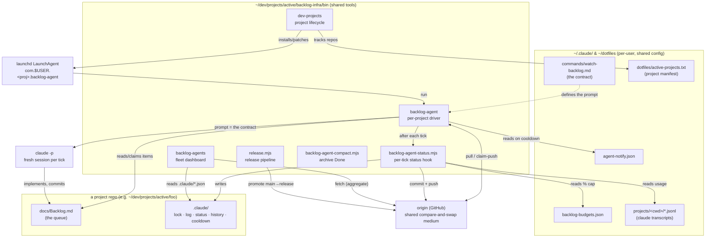
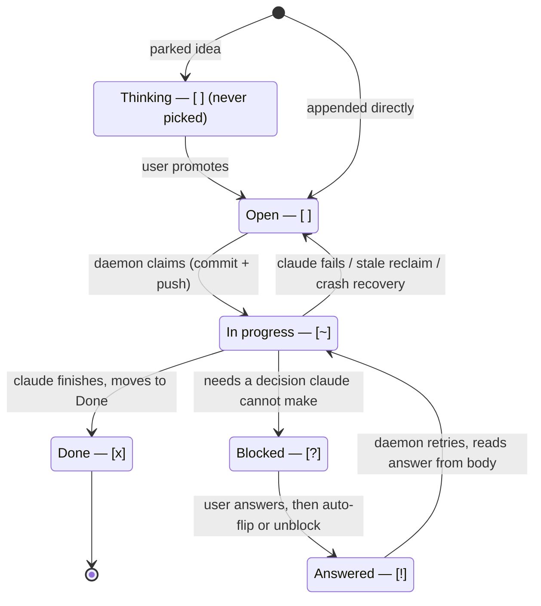
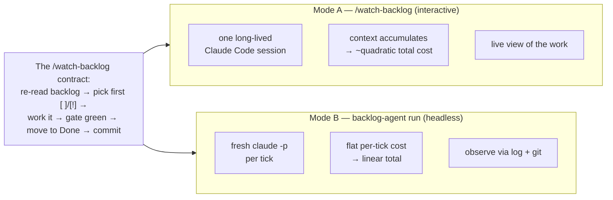
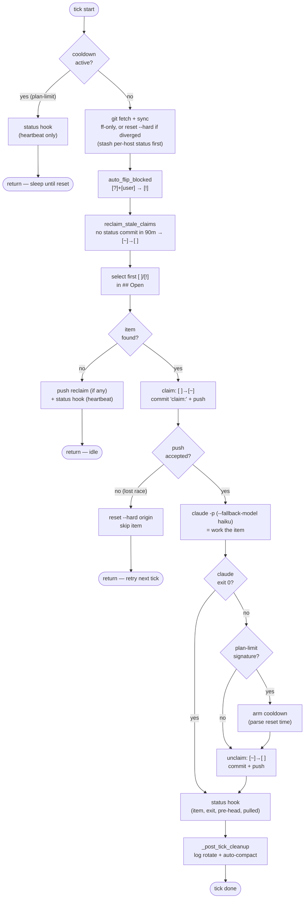
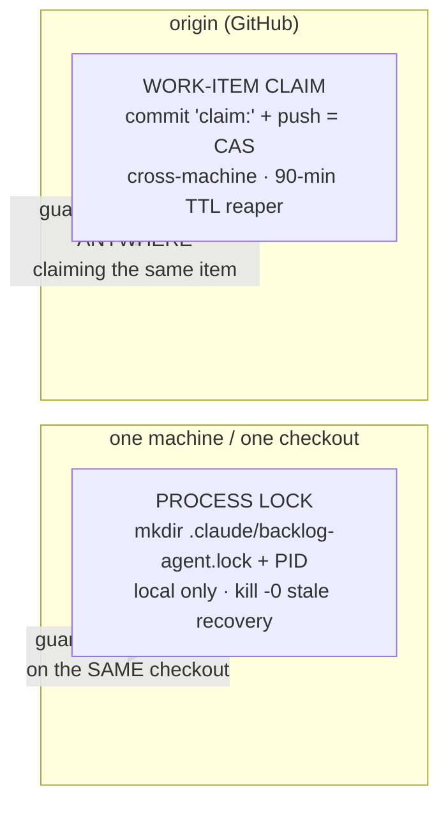
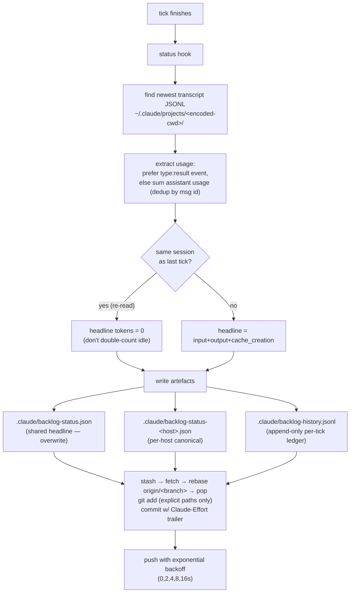
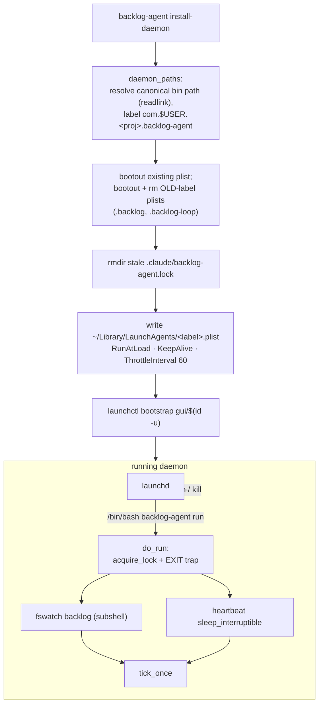
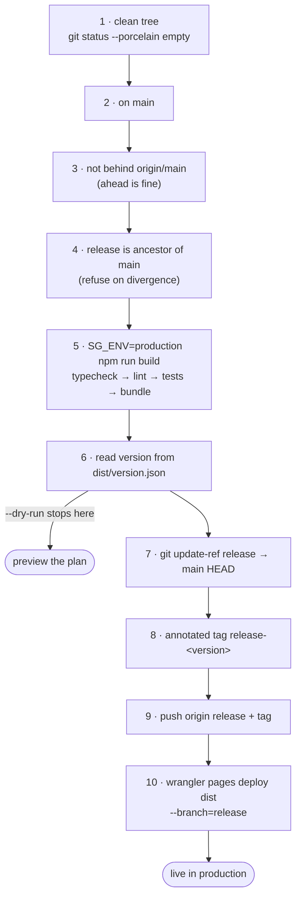
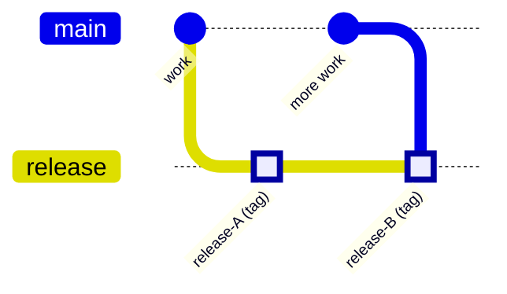

# backlog-infra — architecture & design

`backlog-infra` is the autonomous-backlog system that drives every project
under `~/dev/projects/active/`. A markdown checklist (`docs/Backlog.md`) is the
single source of truth for pending work; a per-project daemon claims items,
hands each one to a fresh `claude -p` session to implement, and records what it
spent — coordinating safely across multiple machines through nothing more than
git pushes.

This document is the **top-down map**: the components, the data they exchange,
and the control flow that ties them together. Two companion docs go deeper on
specific subsystems and are cross-referenced throughout:

- [`cross-machine-locking.md`](./cross-machine-locking.md) — the two locks, the
  full tick lifecycle, cross-machine race handling, and every failure-mode
  recovery path.
- [`multi-agent-design.md`](./multi-agent-design.md) — the (partly deferred)
  plan to fall back to a non-Claude agent under plan-limit pressure.

For the *user-facing workflow* (how a human drives the backlog → release
cycle), see [`../WORKFLOW.md`](../WORKFLOW.md). This doc is about how the
machinery is built.

---

## Contents

1. [The big picture](#1-the-big-picture)
2. [The data model — `docs/Backlog.md`](#2-the-data-model--docsbacklogmd)
3. [Two worker modes](#3-two-worker-modes)
4. [The tick lifecycle](#4-the-tick-lifecycle)
5. [Coordination & locking](#5-coordination--locking)
6. [Status & effort accounting](#6-status--effort-accounting)
7. [Fleet & lifecycle tooling](#7-fleet--lifecycle-tooling)
8. [The launchd daemon model](#8-the-launchd-daemon-model)
9. [The release pipeline](#9-the-release-pipeline)
10. [Resilience & failure handling](#10-resilience--failure-handling)
11. [Multi-agent fallback](#11-multi-agent-fallback)
12. [File & config reference](#12-file--config-reference)
13. [Map of the code](#13-map-of-the-code)

---

## 1. The big picture

Everything in `bin/` is shared and project-agnostic — each tool operates on the
current working directory (`process.cwd()` / `$PWD`) or is `cd`'d into a project
by launchd. The per-project state lives entirely inside each repo's `.claude/`
directory and its `docs/Backlog.md`; the only cross-machine medium is the git
remote (`origin`).



**Reading the map:** the daemon (`backlog-agent`) is the engine — launchd keeps
it alive, it reads the queue, drives `claude -p`, and after every tick the
status hook records the spend into `.claude/` and pushes it. `backlog-agents`
and `dev-projects` are read/maintenance layers on top; `release.mjs` is the
separate, human-triggered promotion path.

| Tool | Kind | Scope | Responsibility |
|---|---|---|---|
| `backlog-agent` | bash | one project (`$PWD`) | claim items, drive `claude -p`, manage the daemon, locks, cooldown |
| `backlog-agent-status.mjs` | node | one project | parse transcript → token usage; write + commit status/history |
| `backlog-agents` | bash | whole fleet | read every repo's `.claude/` state into a dashboard; sync; watchdog |
| `dev-projects` | bash | filesystem of `active/` | clone/scaffold/archive repos; keep the manifest + daemons in sync |
| `release.mjs` | node | one project | 10-step gated promotion `main` → `release` → Cloudflare Pages |
| `backlog-agent-compact.mjs` | node | one project | move old `[x]` items from `## Done` to `## Archive` |
| `_lib.sh` | bash | sourced | shared helpers (age/token formatting, XML escape, GitHub SSH check) |

---

## 2. The data model — `docs/Backlog.md`

The backlog is a plain GFM markdown file with `## ` sections and checklist
items. The marker character inside the brackets is the item's state — the
daemon matches the *raw marker*, not the rendered checkbox (GFM only renders
`[ ]`/`[x]` as boxes; the others render as literal text, which is fine).

| Marker | State | Picked by daemon? |
|---|---|---|
| `- [ ]` | **open** | yes (from `## Open` only) |
| `- [~]` | **in progress** (claimed) | no — already owned |
| `- [?]` | **blocked** on a user decision | no — skipped, surfaced to user |
| `- [!]` | **answered**, ready to retry | yes — reads body for `[user]` answers |
| `- [x]` | **done** | no — moved to `## Done` |

Sections are ordered `Thinking` / `Open` / `In progress` / `Blocked` / `Done`
(+ optional `Archive`). **`## Thinking` is never touched by the daemon** — it's
a parking lot the user manually promotes into `## Open`. Item selection is
scoped to the `## Open` section specifically (`sed -n '/^## Open/,/^## [A-Z]/p'`).

### Item state machine



The `[?]` → `[!]` round-trip is the only point a human is *required* in the
loop. The daemon never guesses a design decision: it flags `[?]`, commits just
the markup, and exits. When the user writes an inline answer (conventionally
prefixed `[user]`), the next tick's `auto_flip_blocked` promotes `[?]` → `[!]`
automatically (or the user runs `backlog-agent unblock <N>`).

**Polyglot file discovery.** During the migration, three locations are accepted
in priority order: `docs/Backlog.md` (canonical) → `Backlog.md` (repo root) →
`backlog.txt` (legacy). Every tool resolves the same way.

---

## 3. Two worker modes

Both modes execute the *same contract* — the prompt string embedded in
`backlog-agent` (`tick_once`) is a near-verbatim copy of
`~/.claude/commands/watch-backlog.md`. They differ only in how the session is
hosted. **Run exactly one at a time** — both drain `[ ]` items and would race.



- **Mode A** lives inside a Claude Code session via the `/watch-backlog` slash
  command (a `/loop` worker woken by `fswatch` on the backlog + a 30-min
  heartbeat). Good for debugging and watching work in real time. Cost grows
  because every tick replays the growing conversation.
- **Mode B** is the `backlog-agent` driver spawning a cold `claude -p` per tick.
  Set-and-forget; flat per-task cost. Packaged as a launchd daemon for true
  autonomy (see §8). This is the production path.

A `.claude/watch-backlog.ping` sentinel (touched by the slash command each
iteration) guards against accidental overlap: `run`/`tick`/`watch` refuse to
start if the ping is younger than 3 minutes.

---

## 4. The tick lifecycle

`tick_once` in `backlog-agent` is the heart of the system. One tick = at most
one item worked. The driver loop calls it on every `fswatch` event and on each
heartbeat, sleeping between ticks with an **escalating idle backoff** (fast
`300s` for the first 4 work-ticks, then `1800s`; idle ticks back off
`30→60→120→300→600→1800s` and reset the moment work appears).



Key properties:

- **The claim is a compare-and-swap via git push.** Flipping `[ ]→[~]` and
  pushing the `claim:` commit *before* running claude means another machine
  that pulls sees the item already owned. First to push wins; the loser resets
  and retries. (Full walkthrough in
  [`cross-machine-locking.md`](./cross-machine-locking.md#cross-machine-race-visual-walkthrough).)
- **claude owns the actual work commit.** The driver only manages the claim
  marker. claude reads the contract, implements, runs the gate, moves the item
  to `## Done`, and commits — all inside the `claude -p` invocation.
- **Idle and cooldown ticks skip claude entirely** — they only heartbeat the
  status file so the fleet view knows the daemon is alive, without burning
  tokens.
- **`--fallback-model claude-haiku-4-5`** absorbs transient Anthropic overload
  of the default model (Layer 1 of the multi-agent design). It does *not* help
  with plan-limit exhaustion — that's what the cooldown is for.

---

## 5. Coordination & locking

Two **separate** mechanisms do two different jobs. Conflating them is the
classic confusion — see [`cross-machine-locking.md`](./cross-machine-locking.md)
for the authoritative treatment; this is the one-paragraph summary.



- **Process lock** (`acquire_lock`): `mkdir` is atomic, so only one daemon
  process per checkout wins. The winner writes its PID; a stale lock (recorded
  PID no longer alive via `kill -0`) is reclaimed, and any orphaned `[~]` items
  from the crashed run are flipped back to `[ ]`. *Local by design* — a PID is
  meaningless across machines.
- **Work-item claim**: the `claim:` push to `origin`. There is no distributed
  lock service — `origin` *is* the shared compare-and-swap. A 90-minute TTL
  reaper (`reclaim_stale_claims`) frees `[~]` items if no daemon anywhere has
  pushed a status commit recently (the liveness signal).

**The daemon is idempotent** — any tick's work can be discarded (`reset --hard`)
and redone safely. That invariant is what makes the recovery paths sound.

---

## 6. Status & effort accounting

After every tick the driver invokes the **status hook** — the per-project
`scripts/backlog-agent-status.mjs` if present, else the shared
`bin/backlog-agent-status.mjs` — passing the item title, claude exit code, mode,
pre-tick HEAD, and pull count. The hook turns one tick into a durable,
cross-machine-aggregatable record.



What each artefact is for:

- **`backlog-status.json`** — the headline state (`last_tick_at`, `last_item`,
  `last_exit_code`, `last_tokens`, `driver_sha`, `rolling_7d_tokens`, `backlog`
  marker counts, uncommitted `artifacts`). Overwritten each tick; last-writer-wins
  across machines (cosmetic only). `driver_sha` is the git SHA of the shared
  driver this daemon is running (W1 version-skew — see below).
- **`backlog-status-<hostname>.json`** — the *canonical per-machine* record;
  always stamped with the local host regardless of idle preservation. These are
  the files the tick loop stashes before a pull to avoid merge churn.
- **`backlog-history.jsonl`** — append-only, one JSON line per tick (`ts`,
  `host`, `item`, `exit_code`, `tokens`, `tokens_breakdown`, `num_turns`,
  `work_commit`, `driver_sha`, …). This is the ledger `backlog-agents` replays to
  sum tokens across every host.

### Driver version-skew (W1)

Because `bin/` is *shared*, a fix isn't live until every machine pulls — and a
machine running a stale driver (the 2026-05-28 incident: M1 ran the broken driver
for hours because the fix was unpulled) is invisible until something breaks. To
make "is everyone on the fix?" a glance: the driver stamps each tick's status
with `driver_sha` — the git SHA of the **last commit touching `backlog-infra/bin`**
in the checkout it's running (passed `--driver-sha` → recorded by the status hook
into `backlog-status.json`, the per-host file, and the history ledger). The
`backlog-agents` **MACHINES** table adds a **DRIVER** column comparing each host's
SHA to the reference (`origin/main`'s last `bin` commit) and flags drift in red
with `⚠`; a `driver ref (origin/main bin): <sha>` line shows the target. This is
the *skew-zero* signal the future fleet-freeze uses as its clear condition. The
**on-demand fleet-sync** half (push a driver fix to every machine without waiting
on the 24 h `daemon-sync`) is deferred to ride the D1 freeze-flag; the local
on-demand path already exists as `backlog-agents sync`.

The commit trailer is grep-able: `git log --grep='Claude-Effort'`. The hook
no-ops the commit/push gracefully if `.claude/` is wholesale-gitignored (local
fleet view still works). Token usage is read from the **Claude transcript**, so
it's Claude-specific — an alternative agent would log `0 tok` until extended
(see §11).

### Structured event log (`.claude/backlog-agent-events.jsonl`)

Alongside the freeform human log (`.claude/backlog-agent.log`, tailed by
`backlog-agent log`), the driver emits a **machine-readable JSONL stream** — one
JSON object per line — for the key tick lifecycle events. This exists so the
monitor, metrics, fleet digest, and dead-man's-switch can match on a structured
field instead of grepping log *prose* (which silently breaks when a message is
reworded). The freeform log is unchanged for backward compatibility; the JSONL
file is the new substrate downstream consumers read.

Every line carries a common envelope (`ts` UTC ISO-8601, `event`, `project`,
`host`, `pid`) plus event-specific fields:

| `event` | When | Extra fields |
|---|---|---|
| `tick_start` | top of every tick | — |
| `claim` | item claimed (CAS push landed) | `item`, `rebased` (on retry path) |
| `claim_lost` | claim push failed — another machine won | `item` |
| `claude_exit` | after `claude -p` returns | `item`, `exit_code` |
| `cooldown_armed` | plan/session-limit cooldown written | `until`, `until_epoch`, `reason`, `parsed_from_reset` |
| `status_ok` / `status_fail` | status hook returned 0 / non-zero (or missing) | `item`, `exit_code` / `reason` |
| `tick_done` | tick end | `outcome` (`work`\|`idle`\|`cooldown`\|`claim_lost`), `duration_s`, and on `work`: `item`, `exit_code` |

The emitter (`log_event` in `backlog-agent`) is **dependency-free and
best-effort**: no jq needed (a small built-in `_json_escape` handles quotes,
backslashes, and control chars in item titles), and any write failure or absent
path is a silent no-op so logging can never abort a tick. The file is per-host,
gitignored, and rotated (tail-truncated past 10 MB) in `_post_tick_cleanup`
exactly like the freeform log.

---

## 7. Fleet & lifecycle tooling

Two CLIs sit above the per-project daemon. They never touch a single backlog's
work — they observe and maintain the *fleet*.

### `backlog-agents` — the dashboard

Reads each repo's `.claude/backlog-status.json` + `.claude/backlog-history.jsonl`
across `~/dev/projects/active/*` (and `~/dev/projects/*` as fallback) and
renders a cross-machine, per-host-annotated table: open count, current/last
item, freshness (`fresh` <30 min / `idle` <2 h / `STALE` ≥2 h), and token totals
summed across all hosts that pushed into each repo (via the history-JSONL
replay).

| Subcommand | Purpose |
|---|---|
| *(default)* | render the dashboard snapshot |
| `sync` | pull dotfiles + every active project, restart every agent daemon, reprint |
| `list` | show installed agent launchd labels + their state |
| `doctor` | read-only preflight: report drift between the manifest, project dirs, and daemons + per-project config hygiene (see below) |
| `daemon-sync [--interval N] [--once]` | run `sync` on a loop (default 24 h) |
| `install-watchdog` / `uninstall-watchdog` | (un)install a launchd plist running `daemon-sync` |

Dashboard flags: `--fetch` (git-fetch each repo first), `--watch` (refresh 10s),
`--effort` (log-size column), `--day` (rebucket right column to today),
`--compact`, `--artifacts` (uncommitted changes per host). Requires `jq`.

**`backlog-agents doctor`** codifies the by-hand checks run when the fleet
misbehaves into one read-only command, so "why is the fleet weird" is a 2-second
read instead of manual archaeology. It checks five groups — manifest ↔
project-dir drift (both directions); launchd daemons (double-daemons from old
labels = hard fail, dangling plists, loaded count vs manifest); plists pointing
at canonical de-symlinked paths; per-project config (required `.gitignore`
patterns, status-hook resolves via `node --check`); and globals/tools (budgets
file valid; `git`/`node`/`jq` required, `gawk`/`fswatch` warned — `gawk` avoids
the BSD-awk `-i inplace` footgun). It mutates nothing and exits non-zero on any
hard failure (warnings don't fail), so it's safe to run anytime and usable as a
CI/pre-sync gate.

### `dev-projects` — repo lifecycle

Manages the git repos themselves (a distinct concern from their backlogs). The
filesystem of `~/dev/projects/active/` is the source of truth; a manifest at
`~/dotfiles/active-projects.txt` (`<relative-path>\t<git-url>` per line) lets
other machines mirror the set via `kash_setup.sh`.

| Subcommand | Purpose |
|---|---|
| `new <name>` | scaffold from `templates/dev-project/`, git-init, create GitHub repo, push, install daemon |
| `activate <url>` | clone into `active/`, add to manifest, install daemon |
| `archive <name>` | move to `archived/`, drop from manifest, bootout daemon |
| `sync` | rescan filesystem → rewrite manifest; patch any drifted daemon `WorkingDirectory` + restart |
| `install-daemons` | install a daemon for every active project that lacks one |
| `watch-daemons` / `install-watchdog` | loop `install-daemons` to auto-adopt new projects |
| `status` / `list` | three-column drift read (disk / manifest / daemon); print manifest |

---

## 8. The launchd daemon model

For true set-and-forget, Mode B is packaged as a macOS LaunchAgent.
`backlog-agent install-daemon` templates and bootstraps a plist; the running
daemon then drives the project autonomously, restarting on crash and at login.



Design details that matter:

- **`readlink` in `daemon_paths`** resolves a symlinked `backlog-agent` to its
  canonical path, so the plist's `ProgramArguments` never points at a symlink
  that might move.
- **`maybe_install_daemon`**: an interactive `run`/`watch` auto-installs the
  daemon if none exists (so the work survives reboots), then exits to let the
  daemon take over — avoiding a self-race on the lock.
- **`sleep_interruptible`** runs the heartbeat sleep as a backgrounded job and
  `wait`s on it, so a `SIGTERM` from `launchctl bootout` fires the EXIT trap
  immediately instead of being blocked until the sleep returns (which would
  force launchd to escalate to `SIGKILL` and orphan the lock).
- **Per-tick mutex (`tick_once`)** — `do_run` drives `tick_once` from *two*
  contexts (the fswatch subshell and the poll loop, both shown above). They
  share the daemon-lifetime process lock, but that does not serialize ticks
  within one daemon. A `mkdir`-based per-tick lock at the top of `tick_once`
  ensures only one tick runs at a time; a concurrent trigger skips. Without it,
  a backlog write (e.g. a `claim:` commit) trips fswatch mid-tick and a second
  `claude` spawns on the same item — the runaway that surfaces when recovering
  a long-stale item (reclaim re-fires every tick until a fresh status commit).
- **Old-label retirement**: pre-rename daemons used `.backlog` / `.backlog-loop`
  labels. Install boots them out *and* removes their plists (a stray `RunAtLoad`
  plist would resurrect a second daemon at next login → double-daemon).

---

## 9. The release pipeline

Release is the **only human-triggered, out-of-band** path — the autonomous
worker never promotes to production. `release.mjs` is a single fail-fast entry
point: nothing touches `origin` or the CDN until the local gate (steps 1–6)
passes. `--dry-run` runs steps 1–6 only.



### The `main` ↔ `release` branching model



- **`main`** — active development; all commits land here directly (no feature
  branches). CI lints + builds but never deploys.
- **`release`** — a moving pointer to *the commit currently live in
  production*. No commits of its own; only ever fast-forwarded by the release
  script, each fast-forward paired with an annotated `release-*` tag.
- **Invariant: `release` is always an ancestor of `main`** (step 4 enforces it).

The CDN's "production branch" setting is `release`, so `wrangler … --branch=release`
lands at the prod URL; any other branch label is a preview deploy. The shared
`release.mjs` takes `--project <cf-name>`; per-project wrappers in
`scripts/release.mjs` delegate to it.

**Failure handling:** if push (9) succeeds but deploy (10) fails, the tag and
branch are already good — the error prints the exact `wrangler` retry command.
Never re-tag.

---

## 10. Resilience & failure handling

The system assumes ticks crash, networks flap, and two machines collide. Every
recovery path is built on the **idempotent-tick** invariant. Summary table; the
deep walkthroughs (with diagrams) are in
[`cross-machine-locking.md`](./cross-machine-locking.md#failure-modes--recovery).

| Failure | Detection | Recovery |
|---|---|---|
| Daemon SIGKILL'd, lock orphaned | `kill -0 PID` on next start | reclaim lock; flip orphaned `[~]`→`[ ]` (same machine) |
| Claim never completed (dead daemon, other machine) | no status commit in 90 min | TTL reaper flips all `[~]`→`[ ]`, pushes `reclaim:` |
| Claude push failed → local HEAD diverged | `merge-base --is-ancestor` check on pull | `reset --hard origin/<branch>`; work redone if still open |
| Claim push lost a race | push rejected | `reset --hard origin`; skip item, retry next tick |
| Dirty tree blocks the status-hook rebase | claude exited abnormally | `git stash --include-untracked` before rebase, pop after (no data loss) |
| Anthropic plan/session limit hit | grep `PLAN_LIMIT_REGEX` on claude output | arm cooldown (parse exact reset time), heartbeat-only until reset |
| Per-host status files conflict on pull | `git diff --quiet` on `.claude/*-status-*.json` | stash those files before ff/reset, pop after |
| `Done` section grows unbounded | `>20` `[x]` items | auto-compact moves them to `## Archive` |
| Log grows unbounded | `>10 MB` | rotate to last 5000 lines |

Two implementation gotchas worth knowing: BSD `awk` (macOS default) silently
no-ops `-i inplace`, so claim/unclaim use `_local_awk_inplace` (gawk if present,
else tempfile + `mv`); and `set -e + pipefail` would abort the daemon on any
non-zero `claude` exit, so the claude pipeline is wrapped `|| claude_exit=${PIPESTATUS[0]}`
to keep the failure local and preserve the real exit code.

---

## 11. Multi-agent fallback

When Claude is unavailable, the design (deferred in parts) is a three-layer
fallback. Full investigation and rationale in
[`multi-agent-design.md`](./multi-agent-design.md).

- **Layer 1 — model fallback (shipped):** `--fallback-model claude-haiku-4-5`
  on the `claude -p` call. Absorbs transient overload of the default model.
- **Layer 2 — plan-limit cooldown (shipped):** on a non-zero claude exit, grep
  for the plan-limit signature; if matched, write `.claude/agent-cooldown.json`
  with the parsed reset time. `tick_once` short-circuits to heartbeat-only while
  the cooldown is active, sleeping precisely until the reset moment. Optional
  Slack/email alert via `~/.claude/agent-notify.json` (`notify_cooldown`).
- **Layer 3 — alternative agent (opt-in, design only):** an opt-in
  `~/.claude/agent-fallback.json` would route the same prompt through a
  non-Claude agent (e.g. OpenCode + DeepSeek) during cooldown. The contract is
  the markdown backlog + git history, both agent-agnostic; the friction is that
  the status hook reads Claude's transcript path and would log `0 tok` until
  extended.

---

## 12. File & config reference

### Per-project — `<repo>/.claude/`

| Path | Written by | Tracked in git? | Purpose |
|---|---|---|---|
| `backlog-agent.lock/` (+ `pid`) | `acquire_lock` | no (gitignored) | process lock (daemon-lifetime, one per checkout) |
| `backlog-agent.tick.lock/` | `tick_once` | no (gitignored) | per-tick mutex — serializes the fswatch + poll drivers within one daemon |
| `backlog-agent.log` | `tick_once` (tee) | no | live worker log (rotated at 10 MB) |
| `backlog-agent-events.jsonl` | `log_event` | no (gitignored) | structured event stream — one JSON line per lifecycle event (rotated at 10 MB); see §6 |
| `backlog-agent-tick.inflight` | `tick_once` | no | `<pid>\t<epoch>\t<title>` of in-flight tick |
| `agent-cooldown.json` | `start_cooldown` | no | plan-limit cooldown `until_epoch` |
| `launchd-{stdout,stderr}.log` | launchd | no | daemon stdio |
| `backlog-status.json` | status hook | no (gitignored) | headline state; **local-only** — the hook writes it every tick but never commits it (per-host + history carry the cross-machine record), so tracking it only churned the tree and piled up auto-stashes |
| `backlog-status-<host>.json` | status hook | **yes** | per-host canonical record |
| `backlog-history.jsonl` | status hook | **yes** | append-only per-tick ledger |
| `../docs/Backlog.md` | daemon + claude | **yes** | the queue |

### Per-user — `~/.claude/` & `~/dotfiles/`

| Path | Read/written by | Purpose |
|---|---|---|
| `~/.claude/commands/watch-backlog.md` | the contract | source of the per-tick prompt |
| `~/.claude/backlog-budgets.json` | status hook / dashboard | personal token targets (bullet graphs) |
| `~/.claude/plan-limits.json` | status hook | cap for the `% of 5h` trailer segment |
| `~/.claude/agent-notify.json` | `notify_cooldown` | Slack webhook / email for cooldown alerts |
| `~/.claude/agent-fallback.json` | Layer 3 (design) | opt-in alternative-agent command |
| `~/.claude/projects/<encoded-cwd>/*.jsonl` | status hook (read) | claude transcripts → token usage |
| `~/Library/LaunchAgents/com.$USER.<proj>.backlog-agent.plist` | `install-daemon` | the LaunchAgent |
| `~/dotfiles/active-projects.txt` | `dev-projects` | the project manifest |

### Tunables (constants in `backlog-agent`)

| Constant | Default | Meaning |
|---|---|---|
| `HEARTBEAT_SECONDS` | `1800` | steady-state heartbeat between ticks |
| `FAST_TICKS` / `FAST_SECONDS` | `4` / `300` | fast-start cadence after work appears |
| `DEBOUNCE_SECONDS` | `2` | debounce after an `fswatch` event |
| `ESCALATING_IDLE_SLEEP` | `30 60 120 300 600 1800` | idle backoff schedule |
| `COOLDOWN_SECONDS` | `3600` | fallback cooldown when reset time can't be parsed |
| stale-claim TTL | `5400` (90 min) | `reclaim_stale_claims` liveness window |

---

## 13. Map of the code

```
backlog-infra/
├── bin/
│   ├── backlog-agent            # per-project driver (1300 lines): tick_once,
│   │                            #   locks, claim/cooldown/reclaim, daemon install
│   ├── backlog-agent-status.mjs # per-tick status hook: transcript → status/history
│   ├── backlog-agents           # fleet dashboard + sync + watchdog
│   ├── dev-projects             # repo lifecycle + manifest + daemon maintenance
│   ├── backlog-agent-compact.mjs# archive ## Done → ## Archive
│   ├── release.mjs              # 10-step release pipeline
│   └── _lib.sh                  # shared helpers (sourced)
├── templates/dev-project/       # scaffolding for `dev-projects new`
│   ├── docs/Backlog.md          #   starter backlog
│   ├── scripts/release.mjs      #   wrapper → bin/release.mjs --project <name>
│   ├── scripts/backlog-agent-status.mjs  # per-project copy of the hook
│   ├── package.json · .gitignore
├── docs/
│   ├── architecture.md          # ← this document
│   ├── cross-machine-locking.md # locks, tick lifecycle, recovery (deep dive)
│   ├── multi-agent-design.md    # the 3-layer fallback investigation
│   └── Backlog.md               # this repo's own backlog
├── WORKFLOW.md                  # the user-facing backlog→release workflow
├── CLAUDE.md                    # repo context for Claude
└── package.json
```

**Where to start reading the code:** `backlog-agent`'s `tick_once` (the engine),
then `backlog-agent-status.mjs`'s `main` (the data producer), then
`backlog-agents`'s dashboard rendering (the data consumer). The two companion
docs cover the parts that are too subtle to leave implicit — read
`cross-machine-locking.md` before touching `acquire_lock`, the claim block, or
any sync logic.
