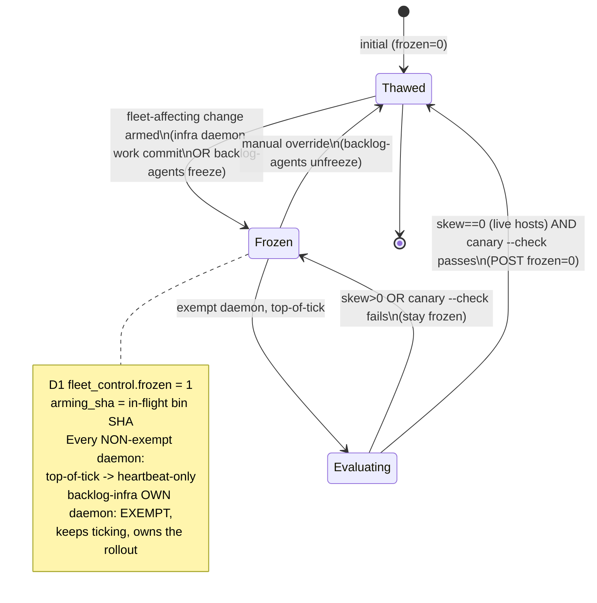

# Fleet freeze on in-flight driver changes — design

**Status: DRAFT (W3), 2026-05-28.** Backlog item: *(P2 · W3) Fleet freeze on
in-flight driver changes (infra = highest priority)* — pause-primitive consumer,
`scope=fleet`. This is a **composite** that wires together pieces already built
in W1/W3: the D1 telemetry bus + `heartbeat_epoch` (W1, live), the `driver_sha`
version-skew signal (W1, shipped), and `backlog-agents canary --check` (W3 gate,
shipped). This doc specifies the freeze flag itself — where it lives, who reads
it, the state machine, and the exempt-daemon gotcha that prevents deadlock.

Read alongside `architecture.md` §5 (coordination), §7 (`canary` + `doctor`),
§8 (the launchd daemon model), and `d1-telemetry-schema.md` (the D1 schema and
the ingest/heartbeat path this reuses).

---

## 1. The problem

`bin/` is **shared** — every project on every machine runs the same
`backlog-infra/bin/` checkout. A change to the machinery therefore affects the
whole fleet at once. The 2026-05-28 cooldown-add bug is the canonical incident:
one bad driver commit silently broke all 7 daemons, and they kept ticking on
stale, broken infrastructure for hours because nothing told them to stop.

The desired behavior: **when a fleet-affecting infra change is in flight, the
rest of the fleet pauses to heartbeat-only rather than working on infrastructure
that is mid-flight or unverified.** Once the change has propagated everywhere and
been validated, the freeze auto-clears and the fleet resumes.

Two design traps this doc explicitly avoids:

1. **Gate on deployment freshness, NOT on "infra backlog empty."** The infra
   backlog never empties — there is always more hardening to do. Freezing the
   fleet until `backlog-infra`'s `## Open` is empty would starve every other
   project forever. The freeze clears on *propagation + validation* of the
   in-flight change, independent of how much infra work remains.
2. **`backlog-infra`'s own daemon must be EXEMPT from the freeze.** The daemon
   that has to land and verify the fix is the one daemon that must keep ticking
   while the flag is set. If it froze itself, the freeze could never clear →
   permanent deadlock. See §6.

---

## 2. Trigger — what counts as "fleet-affecting"

The freeze is armed by a **fleet-affecting** change, which is distinct from
infra *feature/doc* work that must NOT pause anyone (e.g. editing this doc,
`docs/architecture.md`, `WORKFLOW.md`, or adding a new template). The
distinction is **path-based**, reusing the protected-path signal (P2 · W2):

A change is **fleet-affecting** iff it touches any of:

- **`bin/`** — the shared driver, status hook, dashboard, lifecycle tooling, and
  `release.mjs`. Anything here runs on every machine.
- **the status hook contract** — `bin/backlog-agent-status.mjs` (it is under
  `bin/`, but called out because a hook change can break telemetry/liveness fleet-wide).
- **the tick contract** — `~/.claude/commands/watch-backlog.md` and the embedded
  `tick_once` prompt string (they must stay in lockstep; a change to the contract
  changes what every daemon does).

Changes that touch *only* `docs/`, `templates/`, `*.md`, or test fixtures are
**infra feature/doc work** and do NOT arm the freeze. This is the same
protected-path classifier the W2 item builds; fleet-freeze is a consumer of that
signal, not a second copy of it.

> **DRAFT note:** the protected-path list (W2) is the authoritative source of the
> fleet-affecting path set. Until W2 lands, the bootstrap set above is the
> working definition. Fleet-freeze should call the W2 classifier, not duplicate
> the glob list, so the two never drift.

### Who arms it

Arming is deliberately **not** automatic-on-every-bin-commit (that would freeze
the fleet on a trivial comment fix). The arming surface:

- **`backlog-infra`'s own daemon**, when its tick produces a *fleet-affecting*
  work commit (detected via the protected-path signal against the tick's diff),
  arms the freeze as part of committing — "I just changed shared machinery; hold
  the fleet until it's propagated + validated."
- **Manual** — `backlog-agents freeze [--reason ...]` for a human pushing a
  driver fix by hand.

The clear path (§5) is the same for both: it is condition-driven, so an armed
freeze always has a well-defined exit.

---

## 3. Mechanism — a D1 freeze flag every daemon checks at top-of-tick

The freeze flag is a **single fleet-wide row in D1**, consulted by every daemon
at the very top of `tick_once` — the same structural position as the existing
plan-limit `cooldown_active()` check (`backlog-agent` §490). When set, the tick
short-circuits to **heartbeat-only**: no claim, no `claude -p`, no token spend —
just push the status/heartbeat so the fleet view still sees the daemon as alive
(exactly the cooldown short-circuit behavior in `architecture.md` §4).

```
tick_once:
  if cooldown_active():            -> heartbeat-only, return   (existing, plan-limit)
  if frozen() and not exempt():    -> heartbeat-only, return   (NEW, this doc)
  ... normal pull / claim / claude ...
```

`frozen()` is the cheap read path described in §4. `exempt()` is the
`backlog-infra`-own-daemon carve-out in §6.

### Where the flag lives

Reuse the **D1 telemetry bus** (`d1-telemetry-schema.md`) — it is the only
cross-machine, commit-independent channel the fleet has, and the freeze flag
*must* be commit-independent for the same reason liveness is: a frozen fleet
must not depend on git pushes succeeding.

A dedicated **single-row control table** (not piggybacked on `health_status`,
which is per-`(project, host)` — the freeze is *global*):

```sql
-- additive migration in backlog-dashboard (sibling of 0001_telemetry.sql)
CREATE TABLE IF NOT EXISTS fleet_control (
  key            TEXT PRIMARY KEY,        -- 'freeze' (singleton row)
  frozen         INTEGER NOT NULL DEFAULT 0,
  reason         TEXT,                    -- human/why string for the dashboard
  armed_by       TEXT,                    -- host or 'manual'
  armed_at_epoch INTEGER,
  arming_sha     TEXT,                    -- the fleet-affecting bin SHA in flight
  updated_at     TEXT NOT NULL
);
```

- **Read** the flag via a tiny `GET /api/fleet-control` endpoint (or fold into
  the existing `GET /api/health` snapshot so the daemon's existing poll carries
  it — preferred, zero new round-trips). A point lookup on a one-row table is the
  cheapest possible D1 read (well under the 5M-rows/day free-tier ceiling; see
  `d1-telemetry-schema.md` §2).
- **Write** the flag via `POST /api/fleet-control` (bearer-auth, mirroring
  `/api/health-ingest`). Arm sets `frozen=1` + `arming_sha`; clear sets
  `frozen=0`.

The status hook already POSTs to `kash-backlogs.pages.dev` every tick
(`backlog-agent-status.mjs` ~line 496). The freeze read should ride that same
ingest response (the ingest returns the current freeze state in its response
body), so a tick learns the freeze state **for free** on the heartbeat it
already sends — no separate request, no new failure mode.

### Cheap read path + fail-safe

The freeze read **must be fail-open** in the sense that matters: if D1 is
unreachable, a daemon **errs toward NOT freezing the broader fleet on a phantom
flag** — but the converse (a daemon that *can't confirm* the freeze cleared) is
the safer direction here. Concretely, mirroring DECISION 1 in
`d1-telemetry-schema.md`:

- **D1 reachable, `frozen=1`** → freeze (heartbeat-only), unless exempt.
- **D1 reachable, `frozen=0`** → normal tick.
- **D1 UNREACHABLE** → **treat as NOT frozen** (fail-open). Rationale: a freeze
  is a transient hold during a controlled rollout; if the control plane is down,
  the operator can fall back to the manual fleet pause/stop control (W3 sibling
  item) or `launchctl bootout`. Blocking the whole fleet on an unreachable D1
  would itself be a fleet-wide outage. This is a **DRAFT decision** — see §7,
  DECISION C.

The read is dependency-light (the ingest response is already parsed; the freeze
fields are a few extra keys). Cache the last-seen freeze state in
`.claude/fleet-freeze.cache` so a single failed poll doesn't flap a daemon's
behavior between ticks.

---

## 4. Clear condition — version-skew zero AND `canary --check` passes

The freeze **auto-clears** when both hold, reusing the W1/W3 primitives:

1. **Version-skew is zero** — every live host's `driver_sha` equals the
   reference (`origin/main`'s last `bin` commit), i.e. the in-flight change has
   *propagated* everywhere. This is exactly the signal the `backlog-agents`
   MACHINES table already computes (`architecture.md` §6, "Driver version-skew");
   the data is the per-host `driver_sha` in D1 `health_status` + the `heartbeat`
   freshness so dead hosts don't block the clear.
2. **`canary --check` passes** — the running driver's bin SHA has a recorded
   canary pass (`backlog-agents canary --check`, `architecture.md` §7). This is
   the "the change is *validated*, not just propagated" half. It is the same gate
   the D1 reaper-restart consults, so a daemon never resumes on an unvalidated
   driver.

> **Skew-zero needs a liveness filter.** "Every host on the reference SHA" must
> mean every *live* host — a powered-off laptop must not pin the freeze forever.
> Use the `heartbeat_epoch` freshness window (the same `STALE_CLAIM_SECONDS`
> notion) to consider only hosts that have heartbeated recently. **DRAFT
> decision** — see §7, DECISION B.

### Who evaluates the clear condition

The clear is evaluated by **`backlog-infra`'s own (exempt) daemon** — it is the
only daemon still ticking while the flag is set, and it owns the rollout. At the
top of each of its ticks (after confirming it is the exempt daemon), if
`frozen=1`, it evaluates `skew_zero AND canary --check` and, when both pass,
POSTs `frozen=0` (records who/why in `fleet_control`). A **manual override**
(`backlog-agents unfreeze`) clears it unconditionally.

Evaluating the clear in one place (the exempt daemon) avoids a thundering-herd
of every daemon racing to clear the same flag.

---

## 5. State machine



Transitions:

| From | To | Trigger |
|---|---|---|
| Thawed | Frozen | fleet-affecting change armed (infra daemon commit, via protected-path signal) or `backlog-agents freeze` |
| Frozen | Evaluating | exempt (infra) daemon reaches top-of-tick while `frozen=1` |
| Evaluating | Frozen | version-skew > 0 across live hosts, OR `canary --check` fails |
| Evaluating | Thawed | version-skew == 0 (live hosts) AND `canary --check` passes → POST `frozen=0` |
| Frozen | Thawed | manual `backlog-agents unfreeze` (unconditional) |

While **Frozen**, every non-exempt daemon's tick is: read flag → heartbeat-only →
return. No claims, no token spend. The fleet view shows daemons as alive (fresh
heartbeats) but explicitly *frozen* (the dashboard surfaces `fleet_control.reason`).

---

## 6. CRITICAL gotcha — `backlog-infra`'s own daemon is EXEMPT

The whole mechanism deadlocks unless the daemon responsible for landing and
verifying the fix is **exempt from the freeze it (or a human) armed**:

- The freeze clears only when skew is zero **and** the canary passes.
- Getting to skew-zero requires the fix to propagate, and getting the canary to
  pass may require the infra daemon to *land more commits* (the fix itself, or
  follow-up corrections).
- If the infra daemon froze itself, it would heartbeat-only, never land those
  commits, the clear condition would never be met, and **the freeze would be
  permanent for the entire fleet.**

So `exempt()` returns true iff the current project is `backlog-infra`. The check
is local and cheap: the daemon already knows its project (the launchd label
`com.$USER.backlog-infra.backlog-agent` / `$PWD` basename). The exempt daemon
treats the freeze as a *signal to evaluate the clear condition*, not a signal to
stop.

This pairs with the existing operating rule that **`backlog-infra` ticks at
highest priority** (priority-weighted scheduling, W3 sibling) — the exempt
daemon should be the *most* active during a freeze, not the least, so the fix
lands and the fleet thaws quickly.

> Edge case (DRAFT): if `backlog-infra`'s daemon is itself **down** (e.g. the
> machine that owns it is off), no one evaluates the clear condition → the
> freeze sticks until a daemon on another machine adopts infra, or a human runs
> `backlog-agents unfreeze` / `backlog-agents canary` + manual clear. The manual
> override is the backstop. See §7, DECISION D.

---

## 7. Open DECISIONS

- **DECISION A — arming granularity.** Does the infra daemon arm the freeze on
  *every* fleet-affecting work commit, or only when a human/label marks the
  change "fleet-significant"? Auto-on-every-bin-commit is safest (never miss a
  breaking change) but noisiest (freezes the fleet on a one-line comment fix in
  `bin/`). Leaning toward: auto-arm on any protected-path commit, but make the
  clear fast (skew + canary, both already automatable) so the noise cost is low.
  Needs a decision.

- **DECISION B — skew-zero liveness window.** Which `heartbeat_epoch` freshness
  threshold defines a "live" host for the skew-zero clear condition? Reusing
  `STALE_CLAIM_SECONDS` (90 min) is the obvious default, but a host that pulls +
  restarts on a slower cadence could briefly read as live-but-stale-SHA and pin
  the freeze. Confirm 90 min vs. a dedicated freeze-liveness window.

- **DECISION C — fail-open vs fail-closed on unreachable D1.** §3 proposes
  fail-open (D1 down ⇒ treat as not frozen) to avoid a D1 outage becoming a
  fleet outage, with manual pause as the backstop. The opposite (fail-closed:
  D1 down ⇒ stay frozen if last-seen state was frozen) is safer against rolling
  out a known-bad driver but risks a sticky fleet-wide stall. Mirror
  `d1-telemetry-schema.md` DECISION 1 (fail-safe) carefully — note that for the
  *reaper* fail-safe means "don't reclaim," whereas for *freeze* the safe
  direction is genuinely ambiguous and depends on what's worse: an unfrozen
  fleet on a maybe-bad driver, or a frozen fleet that can't thaw. Needs a call.

- **DECISION D — clear-condition evaluator when infra daemon is down.** §6 makes
  the exempt infra daemon the sole evaluator. If it's down, the freeze can't
  auto-clear. Options: (i) any daemon may evaluate-and-clear (drops the
  single-evaluator simplicity, reintroduces a clear race — but a clear race is
  benign since the condition is idempotent); (ii) the dashboard/watchdog
  (`backlog-agents daemon-sync` loop) evaluates the clear as a fleet-level cron;
  (iii) accept manual-only clear in this case. Leaning (ii) — the watchdog
  already runs fleet-wide on a loop and reads all the inputs.

- **DECISION E — arm/clear endpoint vs. ride the health ingest.** §3 prefers
  folding the freeze read into the existing `/api/health` ingest response (zero
  new round-trips) and adding a separate authenticated `POST /api/fleet-control`
  for arm/clear. Confirm the ingest response is the right carrier for the read,
  and that the arm/clear write belongs on its own endpoint (it does — it's a rare,
  privileged operation, unlike the per-tick heartbeat).

- **DECISION F — interaction with the W3 fleet pause/stop/resume sibling.** Both
  this item and *(P2 · W3) Fleet pause / stop / resume control* are
  pause-primitive, `scope=fleet` consumers sharing the same D1-flag substrate.
  Decide whether `fleet_control` is one table with a `mode` column
  (`freeze|pause|stop`) or separate flags. One table with a precedence rule
  (`stop` > `pause` > `freeze`) is the likely shape — design them together so
  they don't fight over the same daemon top-of-tick gate.
